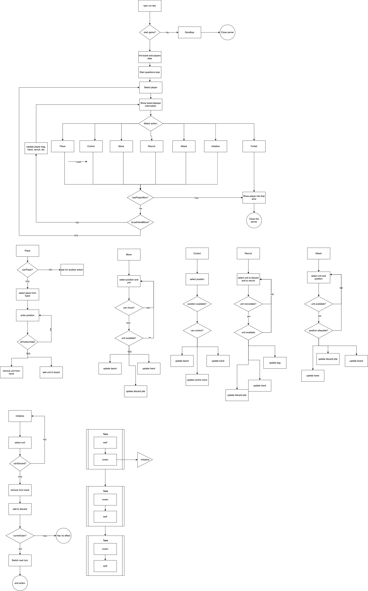

# Warchest-lite

This a lite version of the game [Warchest](https://boardgamegeek.com/boardgame/249259/war-chest)

## Approach

In order to implement the solution I've used the follwogin approac:

- OutsideIn (started with the base logic the users seed and started diving deeper as the program needed more actions)
- Try to follow DDD and OOP best practices using typecript implementing some ValueObject with its logic to separate concerns
- Unit tests of some classes (didn't have much time so I haven't been able to add a good enough good coverage)
- Refactor the classes once the base game is implemented to avoid pre-mature abstractions
- The way its implemented add more actions or units should be quite easy as the only things needed is to add the UnitType and implement the dedicated unit class
- It should be also quite easy (some input change) to add the 9x9 size possibility

## Features

- [TypeScript](https://www.typescriptlang.org/) (v4)
- [Prettier](https://prettier.io/)
- [ESLint](https://eslint.org/) with:
  - [Codely's config](https://github.com/lydell/eslint-plugin-simple-import-sort/) (includes ESLint's recommended rules, Prettier, Import plugin and more)
  - [Jest plugin](https://www.npmjs.com/package/eslint-plugin-jest)
- [Jest](https://jestjs.io) with [DOM Testing Library](https://testing-library.com/docs/dom-testing-library/intro)
- [GitHub Action workflows](https://github.com/features/actions) set up to run tests and linting on push
- [SWC](https://swc.rs/): Execute your tests in less than 200ms
- [Conventionl Commits](https://www.conventionalcommits.org/en/v1.0.0/): Implemented with CommmitLint, Husky & LintStaged

## Working with this project

- Execute the game: `npm run dev`
- Install the dependencies: `npm install`
- Execute the tests: `npm run test`
- Check linter errors: `npm run lint`
- Fix linter errors: `npm run lint:fix`

## Changelog

- Setup skeleton and needed packages
- Setup husky and commitlint
- Add board initialization
- Add prompter
- Add player and
- Add information to show when prompting
- Add Base game loop
- Add selector error handler
- Add forfeit action hanlder and information about the winner
- Add base unit and different user value objetcs to handle units
- Add init coin shaffle information
- Add the rest of the actions
- Add some actions tests
- Refactor actions
- Abstract some logic fromt he actions to the position, player and board classes
- Document & add logic diagram to repo

## To do
- Add domain logic tests
- Refactor Player, Game and Board classes to make them more maintainable and separate concerns better
- Add the missing winning conditions:
  - Player runs out of recruitment pieces, hand and discard pile
  - Player can not recruit
- Double check Initiative as it is not fully working
- Probably rethink the Unit class and add more logic to it

## Acknowledgments

- [Codely typescript skeleton](https://github.com/CodelyTV/typescript-basic-skeleton)

## Assets

